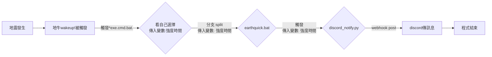

# EEW_line_notify
地震速報、速報軟件、line webhook推播、line webhook推送（配合地牛Wake Up!）

由於地牛wake up!只能觸發*cmd*和*bat*，如果想要推送到其他軟體就要call到python




# 使用說明
## 第一步 架設python環境，請確保系統環境變數中有python路徑(PATH)
*(不示範)*
*推薦python版本: 3.12.2*

## 第二步 取得line notify token
取得連結：https://notify-bot.line.me/my/
### 登入後選擇發行權杖


### 取一個名字、選擇聊天室，點擊複製權杖
*權杖只會出現過一次，請務必好好保管以免洩漏。如果不小心沒複製到，直接重新再新增一個權杖就好了*


## 第三步 下載zip解壓縮在想要的路徑


## 第四步 在地牛wake up!中選擇剛剛下載的earthquick.bat路徑


## 第五步 在line_notify.py中填入剛剛在line notify 申請的權杖
```XXXXXXXXXXXXXXXXXXXXXXXXXXXXXXXXXXXXXXXXXXX```


## 第六步 按自己的需求調整訊息傳送內容


## 第七步 按下地牛wake up!中的測試按鍵
*建議先在自己的聊天室測試，免得嚇到朋友了*


# 常見QA
1) 可不可以將bat和py檔案分在不同地方

> 不行，目前bat是用相對路徑寫的，請將兩個檔案維持在同一個資料夾
